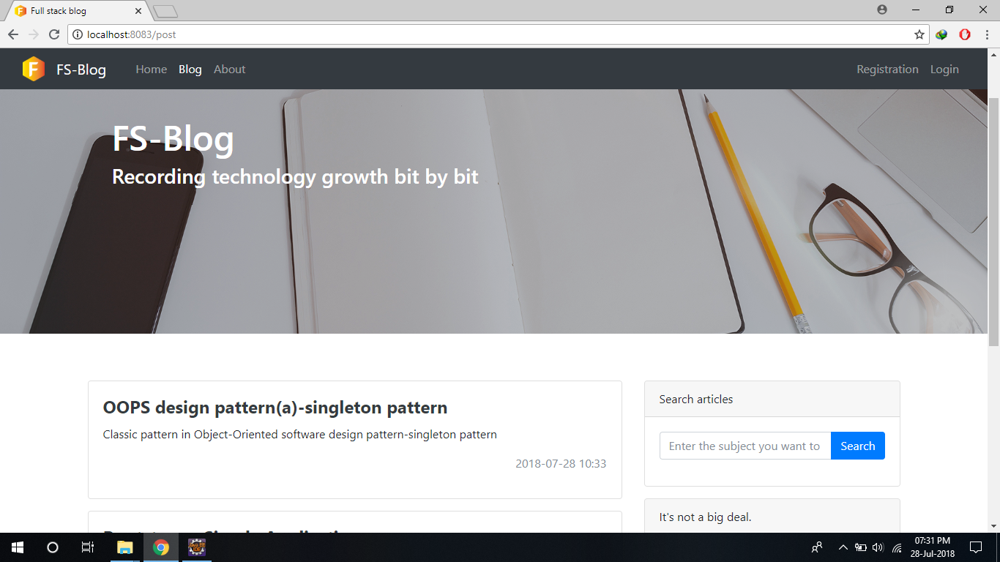

# FS-Blog

## Personal blog based on Spring Boot

### 1. Involving technology and tools

- Core framework: SpringBoot
- ORM framework:MyBatis
- MyBatis tool:MyBatis Mapper 
- MVC framework:Spring MVC
- Template engine: Freemarker
- Compile helper plugins:Lombok
- CSS framework: BootStrap 4.0
- Markdown editor:Editor. md.
- Database:MySQL

### 2. Renderings

#### 2.1 home

#### 2.2 blog list page

#### 2.3 blog reading page

#### 2.4 resume page
![Resume] (screenshots/resume.png)

#### 2.5 article Edit Page

### 3. Build and run

#### 3.1 server environment

- Install " MySQL`
- Install " Gradle`
- Run `gradle clean build "in the project directory, the generated jar package is in the` build/libs" directory, using " java-jar .../ fsblog.jar " run
- Application-dev.yml "in the configuration database user name and password, the default is:" username: root password: root`
- Default automatically creates database, data table and automatically import initial data, also in " application-dev.yml" ,"application-prod.yml" configuration
- Admin default user name is "admin", password is " 123456`

#### 3.2 development environment

- Can open projects for secondary development directly in IntelliJ IDEA or Eclipse

### 4. Contact Email: <url>.

Email:raviteja.bollimuntha@gmail.com

### 5. Open source Protocol

[Apache License 2.0](http://apache.org/licenses/LICENSE-2.0.html)

Copyright (c) 2017-present, ravitejabollimunhta